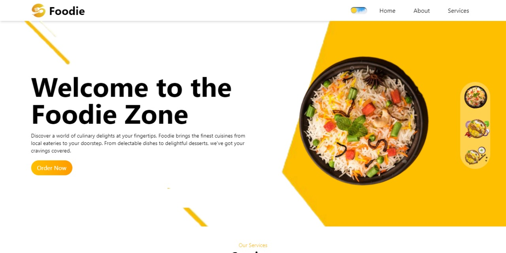

# Foodie - A Culinary Delight

Foodie is a modern, web-based platform designed to tantalize your taste buds and satisfy your cravings with a diverse array of dishes, premium services, and glowing testimonials. Whether you're a food enthusiast, a culinary connoisseur, or simply someone looking for your next delicious meal, Foodie has something for everyone.

## Features

- **Mouth-watering Dishes:** Explore our extensive menu featuring a tantalizing selection of culinary delights from around the world.
- **Premium Services:** Enjoy seamless ordering, swift delivery, and exclusive deals that make every meal a special occasion.
- **Glowing Testimonials:** Read testimonials from satisfied customers sharing their delightful experiences and culinary adventures with Foodie.
- **Tailwind-based Design:** Our sleek and responsive design ensures an optimal user experience across all devices.
- **Dark/Light Mode:** Switch between dark and light modes for a customized browsing experience.

## Sections

### Dishes

Indulge your senses with our curated collection of dishes, from savory entrees to decadent desserts. Each dish is crafted with care and attention to detail, ensuring a memorable dining experience.

### Services

Experience the convenience and reliability of our premium services, including seamless ordering, swift delivery, and exclusive deals. Whether you're ordering for yourself or a group, Foodie makes every meal a breeze.

### Testimonials

Don't just take our word for it – hear what our customers have to say! Read glowing testimonials from satisfied Foodie customers sharing their delightful experiences and culinary adventures.

## Technologies Used

- **React:** Powers the frontend user interface, providing a seamless and interactive experience.
- **Tailwind CSS:** Enhances the frontend with a sleek and modern design system, making Foodie both visually appealing and user-friendly.
- **HTML:** Provides the structure and markup for the web pages, ensuring accessibility and compatibility.
- **JavaScript:** Adds interactivity and dynamic functionality to the frontend, allowing users to explore and interact with Foodie's features.

## Installation

1. Clone the repository: `git clone https://github.com/ShivamSikotra11/Foodie`
2. Navigate to the project directory: `cd Foodie`
3. Start the development server: `npm run dev`
5. Open your browser and visit `http://localhost:5173` to view Foodie in action.

## Usage
1. Website Link: https://starlit-puffpuff-de07fe.netlify.app/
2. Browse the different sections of the website, including Dishes, Services, and Testimonials.
3. Explore the mouth-watering dishes, premium services, and glowing testimonials to discover what Foodie has to offer.

## Screenshots

## Acknowledgments

- [React Documentation](https://reactjs.org/docs/getting-started.html)
- [Tailwind CSS Documentation](https://tailwindcss.com/docs)
- [Unsplash](https://unsplash.com/) for providing high-quality images of food and culinary delights.
